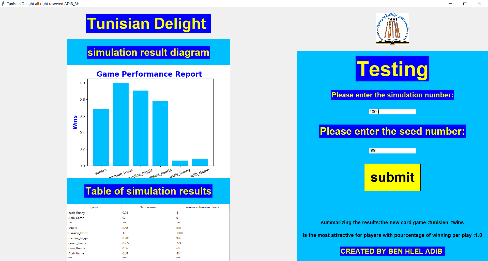

# this is Tunisian delight project

all right reserved by BEN HLEL ADIB 
# image file 

# where and how the testing was done !
```python 
def go(x):
    e={}
    s1,s2,s3,s4,s5,s6=0,0,0,0,0,0
    # x simulation number
    for i in range(x):
        c=sahara()
        s1=s1+c.play()

        c=tunisien_twins()
        s2=s2+c.play()

        c=medina_biggie()
        s3=s3+c.play()

        c=desert_hearts()
        s4=s4+c.play()

        c=Oasis_Runny()
        s5=s5+c.play()

        c=Adib_Game()
        s6=s6+c.play()
    # dictionnaire pour les résulta des jeux
    e["sahara"]=float(s1/x)
    e["tunisien_twins"]=float(s2/x)
    e["medina_biggie"]=float(s3/x)
    e["desert_hearts"]=float(s4/x)
    e["oasis_Runny"]=float(s5/x)
    e["Adib_Game"]=float(s6/x)
    return e

```
Running the program we get the following :


